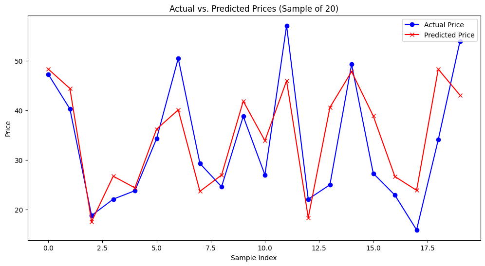

# **Real Estate Price Prediction**

This project aims to predict real estate prices per unit area using machine learning techniques in PySpark. The dataset includes features such as the number of convenience stores, latitude, and longitude, which are used to train a Random Forest regression model.

## **Project Structure**

- **Data Preparation:**
  - Data is loaded from a CSV file into a Spark DataFrame.
  - The data is cleaned by removing duplicates, dropping null values, and filtering records based on certain conditions.

- **Feature Engineering:**
  - Relevant features are assembled into a single vector.
  - Features are scaled using a standard scaler to improve model performance.

- **Modeling:**
  - A Random Forest regressor is used to model the relationship between the features and the target variable (`house_price_per_unit_area`).
  - The model is trained on 70% of the data, and predictions are made on the remaining 30%.

- **Evaluation:**
  - Model performance is evaluated using metrics such as **R²**, **RMSE**, and **MAE** to assess accuracy and predictive power.

- **Persistence:**
  - The trained model is saved to disk and can be reloaded for future predictions.

- **Visualization:**
  - A comparison between actual and predicted prices is visualized using Matplotlib.

## **Installation**

To run this project, you need to have Python, PySpark, and the following libraries installed:

```bash
pip install pyspark
pip install findspark
pip install pandas
pip install matplotlib
```

## **How to Use**

1. **Load the Data:**
   - Replace `Real estate.csv` with your dataset and adjust the code as needed.

2. **Run the Script:**
   - Execute the script to perform data preparation, feature engineering, model training, and evaluation.

3. **Visualize Results:**
   - The script includes a section to visualize the comparison between actual and predicted prices.

4. **Model Persistence:**
   - The model is saved as `House Prediction Model` and can be loaded for future predictions.

## **Example Output**

Here’s an example of the output you can expect:

- **R²:** 0.6945
- **RMSE:** 6.7985
- **MAE:** 5.3386

## **Conclusion**

The model achieves an **R²** score of **0.6945**, indicating that approximately **69.45%** of the variance in house prices per unit area can be explained by the features used in the model. The **RMSE** of **6.7985** and **MAE** of **5.3386** suggest that, on average, the model's predictions are within these values of the actual prices. While the model demonstrates a decent predictive ability, there is room for improvement, potentially through feature engineering, hyperparameter tuning, or exploring more advanced modeling techniques.

## **Visualization**

A plot comparing actual and predicted house prices:




